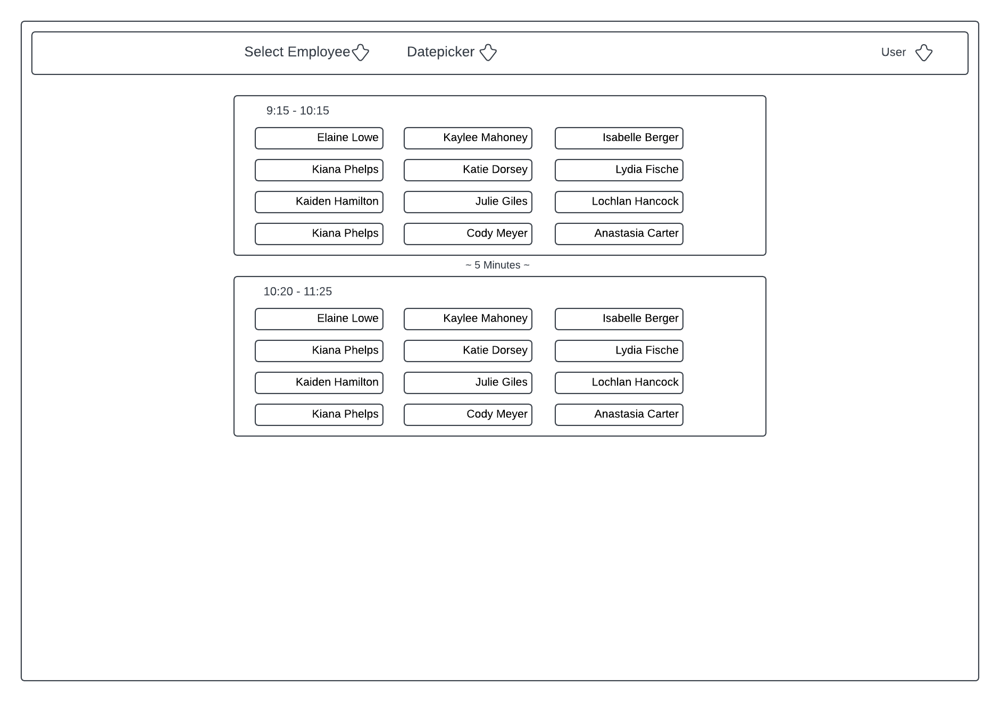

# Installation Steps

- Once the project is cloned you will need to copy the `.env.example` to `.env`
- Enter the `WONDE_TOKEN` to access the Wonde Api.
- Install Composer dependencies with docker.

```
docker run --rm \
    -u "$(id -u):$(id -g)" \
    -v "$(pwd):/var/www/html" \
    -w /var/www/html \
    laravelsail/php82-composer:latest \
    composer install --ignore-platform-reqs
```

- Boot up the docker containers with `./vendor/bin/sail up` or just `sail up` if you have an [alias setup](https://laravel.com/docs/9.x/sail#configuring-a-shell-alias)
- Run `sail artisan key:generate` to generate application key.
- Run `sail artisan migrate` to setup database structure for user management.
- To setup the frontend files with Vite run `sail npm install` then `sail npm run dev`
- Once containers are running and frontend is setup, in open another terminal and run `sail artisan test --coverage` the tests should all pass with line coverage at 91.5%
- The application should be ready to use now, for first use go to `[http://localhost/register](http://localhost/register)` to create an account, you should be forwarded to the dashboard `[http://localhost/dashboard](http://localhost/dashboard)` future login can be reached at `http://localhost/login`
- On the dashboard you should see the first teacher’s classes for the current day, if it doesn’t and says `You're logged in!` please check that Vite is running with `sail npm run dev`

# Design Specification

## User Story

As a Teacher, I want to be able to see which students are in my class each day of the week so that I can be suitably prepared.

## Design Specification

### Frontend

- The frontend will be implemented using Vue.js and TailwindCSS.
- The user will be able to select a day of the week from a dropdown menu.
- The user will be able to an employee from a dropdown menu.
- When a day or employee is selected, the list of students in classes for that day and employee will be updated.
- Time values will be converted to browser local timezone.
- A time value between lessons will show the amount of time between each of the lessons.

### Backend

- The backend will be implemented using Laravel.
- The system will fetch a list of employees, classes, students and lessons from the Wonde Api.
- Redis will be used to store data for a short period of time to prevent large amounts of requests sent to api.

### UI Design



### Api Data Fetching Plan

With a provided `schoolId` I can call the employees endpoint which will provide me with a list of `classIds` with that I can fetch each class and include the lesson times and student names. This should cover the data requirements for this task.

- Employees(SchoolId)
    - forename
    - surname
    - Classes
        - classId
- Classes(classId)
    - Lessons
        - start_at
        - end_at
    - Students
        - forename
        - surname

# Post Implementation Notes

There are a few features and improvement that I would have implemented if given more time. However, Since the main functionality is complete, I have decided to stop here to avoid taking too long to deliver on the technical test. Below are notes on what I would do to improve this.

- Implement better error handling, on controller and api calls with try catches and returning user friendly messages.
- Redis caching for Wonde api responses for quicker load subsequent times and remembering last user selected employee.
- I noticed that some employee lessons are scheduled at the same time. To improve visual representation, I would group them by period instance ID.
- Show periods of time between lessons.
- Refactor frontend typescript code to extract functions and setup testing suite.
- Use PHP Dependency Injection containers to improve test assertion quality on dashboard controller.